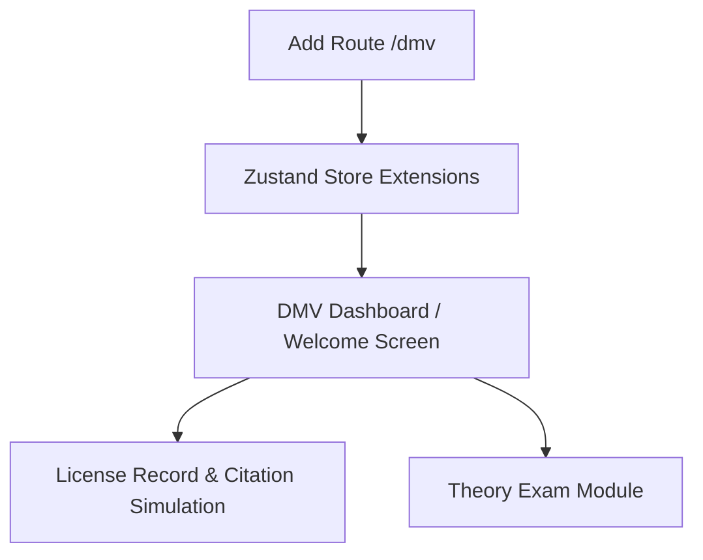

# Implementation Plan — DMV Terminal & Driver Certification Integration

This plan outlines the design and integration of the **DMV Terminal / Government Driver Certification Terminal** into the existing City Hall NUI, based on the provided department design assets and interface workflows.

---

## User Review Required

> [!IMPORTANT]
> **New Nav Node in Sidebar**: We will add a new menu node `"DMV Terminal"` in the sidebar (`Sidebar.tsx`), linking to `/dmv`.
> **Interactive State Store**: We will extend the Zustand store to maintain state for the DMV License (points, violation history list, standing) so that the interactive "SIMULATE CITATION" panel works in real-time, allowing the user to expunge violations and add mock citations.
> **Theory Examination Simulation**: The theory exam will be a fully functional state machine inside the UI with randomized questions, keyboard shortcuts (Press 1-4 for options, Enter to submit), and a dynamic score/mistakes tracker.

---

## Proposed Changes

We will implement the DMV terminal sub-pages using a layout pattern matching the current obsidian theme and glassmorphism styling guidelines.



### 1. State Management Extensions
#### [MODIFY] [usePlayerStore.ts](file:///g:/Dev%20work/city-hall-menu/src/store/usePlayerStore.ts)
- Add state structures for the DMV profile:
  - `dmvRecord`:
    - `points`: number (0 to 12)
    - `standing`: `"clean" | "warning" | "risk" | "suspended"`
    - `violations`: array of `{ id: string, name: string, points: number, date: string, location: string }`
    - `expiryDays`: number
    - `expiryDate`: string
- Add actions:
  - `addViolation(name, points, location)`: Appends a violation, updates total points, recalculates standing.
  - `expungeViolation(id)`: Removes a violation by ID, subtracts points, recalculates standing.
  - `clearRecord()`: Resets points to 0, empties violations list, resets standing to `"clean"`.
  - `renewLicense()`: Resets expiryDays to 1161 and updates expiryDate.

---

### 2. Router & Layout Integration
#### [NEW] [dmv.tsx](file:///g:/Dev%20work/city-hall-menu/src/routes/dmv.tsx)
- Create `/dmv` file-based routing.
- This will act as the nested router/state controller or redirector to nested layouts (`/dmv`, `/dmv/record`, `/dmv/theory`).
- Alternatively, implement `/dmv.tsx` with a sub-state page render (`activeTab: "dashboard" | "record" | "theory"`) to avoid TanStack file generation complexities and keep all components reactive.

#### [MODIFY] [Sidebar.tsx](file:///g:/Dev%20work/city-hall-menu/src/components/layout/Sidebar.tsx)
- Add `DMV Terminal` navigation item with a `FileBadge` or `Car` icon.
- Register `/dmv` in the items array:
  ```typescript
  { to: "/dmv", label: "DMV Terminal", icon: ShieldAlert }
  ```

---

### 3. Components
#### [NEW] [DriverLicenseCard.tsx](file:///g:/Dev%20work/city-hall-menu/src/components/cards/DriverLicenseCard.tsx)
- Design the driver license preview to resemble the DMV asset screenshot.
- Incorporate a biometric wireframe face profile SVG on the left.
- Display full name, DOB, issue & expiry dates, citizen ID, and a green/orange status indicator.
- Reuse the 3D hover tilt animation from `IDCardPreview.tsx`.

#### [NEW] [SegmentedProgressBar.tsx](file:///g:/Dev%20work/city-hall-menu/src/components/ui/SegmentedProgressBar.tsx)
- Build a custom horizontal progress bar showing the 4 status thresholds:
  - **CLEAN** (0-3 points)
  - **WARNING** (4-6 points)
  - **RISK** (7-11 points)
  - **SUSPENDED** (12+ points)
- Fill the segments dynamically based on the current point count.

---

### 4. Page Implementations (Under /dmv)
#### **Dashboard View**
- Left Grid:
  - Large greeting heading "Government Driver Certification Terminal".
  - Interactive 3D Driver License Card.
  - Quick Nav Buttons: "Theory Examination", "Practical Evaluation", "License Record".
- Right Grid:
  - "License Standing" panel with a clean status summary.
  - "Violation Points" panel with `SegmentedProgressBar`.
  - "Recent Violations" list showing the last 3 infractions with "EXPUNGE" actions.

#### **License Record View**
- Left Grid:
  - Header: "LICENSE RECORD / Driver Profile".
  - Driver License Card.
  - "Violation History" list: Full list of violations with "EXPUNGE" buttons.
- Right Grid:
  - Points & Standing panel.
  - Renewal Status panel: Expiry text + "SCHEDULE RENEWAL" button.
  - "Simulate Citation" panel: Live demo buttons to issue violations (+2 Speeding, +3 Red Light, etc.) and a red "Clear Record" button.

#### **Theory Exam View**
- Introduction state:
  - Displays description, duration (4 mins), passing mark (75%), and "BEGIN EXAMINATION ->".
- Question state:
  - Displays top progress HUD: Current question index, timer count, mistakes count, live score.
  - Question prompt: Show category tag, question string, and list of options (A/B/C/D) with hotkeys.
  - Detect keyboard events (1-4 keys to select, Enter to submit/advance).
- Result state:
  - Show a red glowing FAILED banner or green glowing PASSED banner.
  - Summary metrics: score, correct count, mistakes count, pass mark.
  - Scrollable breakdown table listing each question text and a green CORRECT or red WRONG status badge.
  - Footer buttons: "RETAKE" or "REVIEW LICENSE ->".

#### **Practical Evaluation View**
- Introduction state (Certification Module 02):
  - Description details of the driving test checklist, route checkpoints, telemetry monitoring.
  - Action button: "START PRACTICAL ->".
- Active simulation HUD:
  - Visual dashboard drawing: perspective yellow lines road layout, gray audio/telemetry spectrum wave overlay.
  - Top-Left: Examiner prompt box displaying live checkpoint directions, and examiner dialog subtitle.
  - Top-Right: Route progress CP meter (e.g. CP 0/6, 4.2 mi remaining), progress blocks, and "END TEST" button.
  - Bottom: Digital Speed HUD (current speed + speed limit ring), Vehicle Damage % horizontal slider, driving stats (score, mistakes count, penalty license points).
  - Telemetry Loop: Automates a 30s mock route progression (CP 0 to CP 6) with speed changes, checkpoint notifications, and a target obstacle event at CP 3 (speed drop required).
- Result state:
  - Large glowing PASSED (License Issued) or FAILED green/red indicator panel.
  - Final Score, Mistakes, Points Added metrics.
  - Retake or View Record controls.
  - On pass, sets player store's driving license status to `"active"`.

---

## Verification Plan

### Automated Verification
- Run production build command to check router parsing and TS compilation:
  ```bash
  npm run build
  ```
- Run linter:
  ```bash
  npm run lint
  ```

### Manual Verification
- Verify that clicking "Simulate Citation" updates the points, changes the segmented progress bar colors, updates the standing indicator, and populates the violation tables in real-time.
- Verify that keyboard navigation (1-4 and Enter) operates as expected during the theory exam.
- Verify that expunging a violation instantly adjusts the total points and standing.
